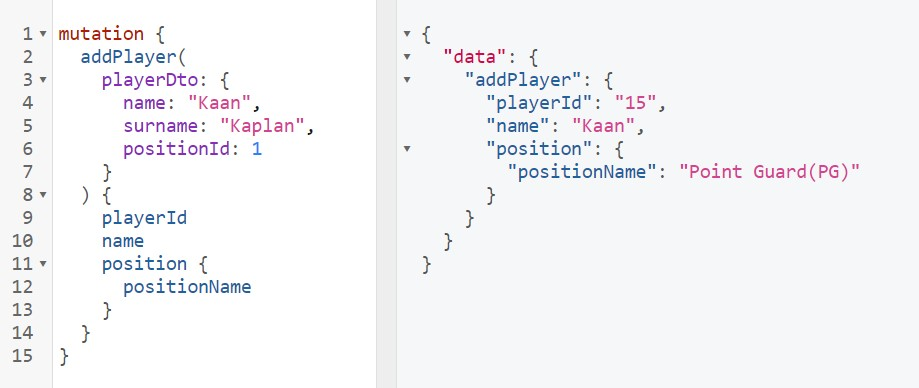
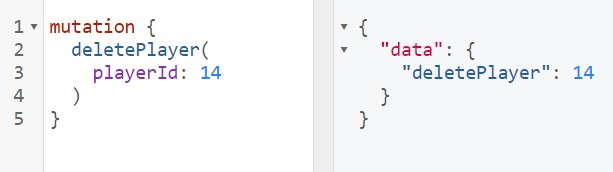
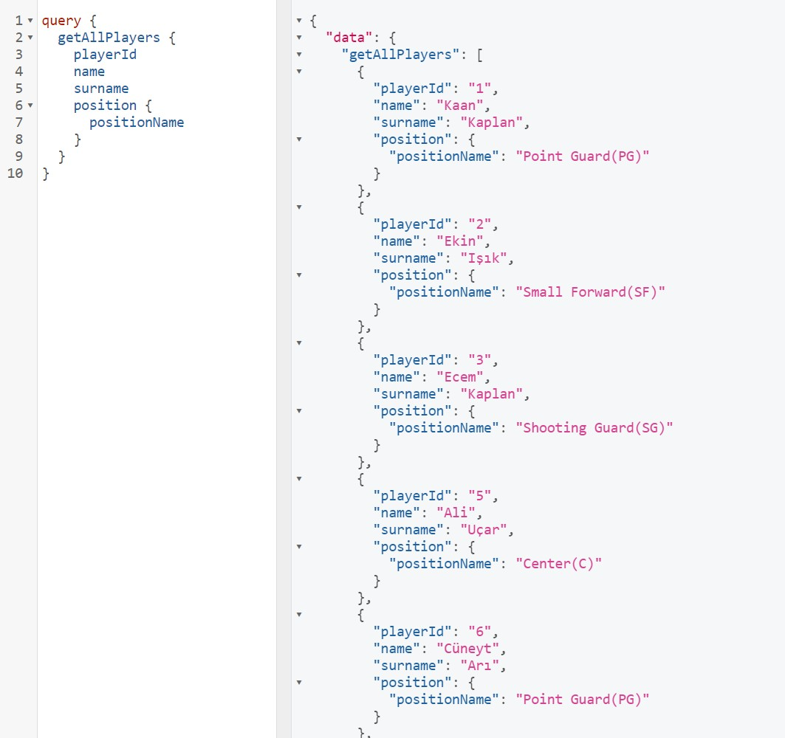

# Basketball Team Management Project
### <li> Producter Backend Developer Internship Task </li>

## Brief
This project is written with Java Spring Boot. In this project,
basketball players can be registered to the system,  deleted or all players can be listed.
GraphQL is used for Api queries. There are 2 mutations and 1 query in this project:
    <li> 1 mutation for single player add. </li>
    <li> 1 mutation for single player delete. </li>
    <li> 1 query is for listed all basketball players. </li>

Each player registered in the system has a name, surname and position. For example, 
point guard(PG), small forward(SF). The basketball team capacity is 12. 
Therefore, no more than 12 players can be added to the system.

## Technologies

N-layer architecture was used as the project architecture.

<li> Spring Web</li>
<li> Spring Data Jpa</li>
<li> GraphQL </li>
<li> PostgreSql </li>
<li> H2 database</li>
<li> Lombok </li>
<li> JUnit </li>
<li> Mockito </li>
 
As a relational database, PostgreSql was used. Additionally, the H2 database was used as an in memory database
when writing the unit test of the data access layer. For Unit testing, JUnit and Mockito was used.
API queries were provided by GraphQL.

### GraphQL Mutations and Queries
#### Add Player

#### Delete Player

#### List All Players In The System

